<!--
╔══════════════════════════════════════════════════════════════════════╗
║  M.A.T.H.E.U.S // NEURAL INTERFACE — README de perfil                ║
║  1. Troque TODAS as ocorrências de  SEU_USUARIO  pelo seu @ do GitHub ║
║  2. Troque os links marcados com  ⟵ EDITAR                           ║
║  3. Suba a pasta /assets e o arquivo .github/workflows/snake.yml     ║
╚══════════════════════════════════════════════════════════════════════╝
-->

<!-- ═════════════════════════ BOOT / BANNER ═════════════════════════ -->
<p align="center">
  
</p>

<!-- ═════════════════════════ TYPING ═════════════════════════ -->
<p align="center">
  <a href="https://github.com/SEU_USUARIO">
    
  </a>
</p>

<p align="center">
  
  
  
</p>

<p align="center"></p>

<!-- ═════════════════════════ 01 · SOBRE MIM ═════════════════════════ -->

```ts
// matheus.config.ts
const operador = {
  codinome:   "M.A.T.H.E.U.S",
  papel:      ["Empreendedor Digital", "Product Builder", "Orquestrador de IA"],
  base:       "Brasil 🇧🇷",
  nicho:      ["Desenvolvimento pessoal", "EdTech"],
  metodo:     "Planejar → Arquitetar → Construir com IA → Validar → Escalar",
  missoes:    ["ENEM AI", "O Código da Disciplina", "Foco Sem Desculpas"],
  padrao:     "Qualidade nível Apple · Linear · Stripe",
  regra_n1:   "Disciplina vence motivação. Todos os dias.",
} as const;
```

> [!NOTE]
> **Não sou o dev tradicional.** Sou o produto, a visão e as decisões: desenho a arquitetura, defino a experiência e conduzo a IA como meu time de engenharia, do primeiro commit ao deploy.

<table>
  <tr>
    <td width="50%" valign="top">

**⚡ Agora**
- 🛰️ Levando o **ENEM AI** para produção
- 📘 Escalando **O Código da Disciplina**
- 🎥 Criando conteúdo no **@focosemdesculpas0**

</td>
    <td width="50%" valign="top">

**🧠 Como eu opero**
- 🗺️ Planejamento antes da execução
- 🤖 IA como copiloto em toda a stack
- 🎯 Obsessão por detalhe visual e conversão

</td>
  </tr>
</table>

<!-- ═════════════════════════ 02 · TECH STACK ═════════════════════════ -->

<p align="center"><sub><code>FRONT-END</code></sub><br/><br/>
  
</p>

<p align="center"><sub><code>BACK-END · DADOS</code></sub><br/><br/>
  
</p>

<p align="center"><sub><code>DEPLOY · CI/CD</code></sub><br/><br/>
  
</p>

<p align="center"><sub><code>IA · PAGAMENTOS · UI · MOTION</code></sub><br/><br/>
  
  
  
  
  
  
  
</p>

<!-- ═════════════════════════ 03 · FERRAMENTAS ═════════════════════════ -->

<p align="center">
  
</p>
<p align="center">
  
  
  
  
</p>

<!-- ═════════════════════════ 04 · PROJETOS ═════════════════════════ -->

<p align="center">
  <a href="https://github.com/SEU_USUARIO/enem-ai"></a>
  <a href="https://SEU-LINK-DA-KIWIFY"></a>
</p>
<p align="center">
  <a href="https://www.tiktok.com/@focosemdesculpas0"></a>
  <a href="https://github.com/SEU_USUARIO"></a>
</p>

<!-- ═════════════════════════ 05 · OBJETIVOS ═════════════════════════ -->

<p align="center">
  
</p>

<!-- ═════════════════════════ 06 · TELEMETRIA ═════════════════════════ -->


<p align="center">
  
  
</p>

<p align="center">
  
</p>

<p align="center">
  
</p>

<!-- ═════════════════════════ 07 · CONQUISTAS ═════════════════════════ -->

<p align="center">
  
</p>

<!-- ═════════════════════════ 08 · SNAKE ═════════════════════════ -->

<p align="center">
  <picture>
    <source media="(prefers-color-scheme: dark)" srcset="https://raw.githubusercontent.com/SEU_USUARIO/SEU_USUARIO/output/snake-cyber.svg" />
    <source media="(prefers-color-scheme: light)" srcset="https://raw.githubusercontent.com/SEU_USUARIO/SEU_USUARIO/output/snake-light.svg" />
    
  </picture>
</p>

<!-- ═════════════════════════ 09 · CONEXÕES ═════════════════════════ -->

<p align="center">
  <a href="https://www.tiktok.com/@focosemdesculpas0"></a>
  <a href="https://instagram.com/SEU_INSTAGRAM"></a>
  <a href="https://www.linkedin.com/in/SEU_LINKEDIN"></a>
  <a href="mailto:SEU_EMAIL@dominio.com"></a>
  <a href="https://SEU-LINK-DA-KIWIFY"></a>
</p>

<!-- ═════════════════════════ RODAPÉ ═════════════════════════ -->
<p align="center"></p>

<p align="center">
  
</p>

<p align="center">
  <sub><code>// conexão encerrada com sucesso</code> · se algo aqui te inspirou, deixe uma ⭐ e volte amanhã: o sistema nunca para de evoluir.</sub>
</p>
