<!--
╔══════════════════════════════════════════════════════════════════════╗
║  MTH // NEURAL INTERFACE — README de perfil (edição combinada)       ║
║  1. Troque TODAS as ocorrências de  msalvajoli  pelo seu @ do GitHub ║
║  2. Troque os links marcados com  SEU_...                            ║
║  3. Suba a pasta /assets e o arquivo .github/workflows/snake.yml     ║
╚══════════════════════════════════════════════════════════════════════╝
-->

<!-- ═════════════════════════ SYSTEM BOOT ═════════════════════════ -->
<p align="center">
  
</p>

<p align="center">
  <a href="https://github.com/msalvajoli">
    
  </a>
</p>

<p align="center">
  
  
  
  
</p>

<p align="center"></p>

<!-- ═════════════════════════ 01 · SOBRE MIM ═════════════════════════ -->


```yaml
OPERADOR:
  nome:      "Matheus"
  codinome:  "MTH"
  papel:     ["Empreendedor Digital", "Product Builder", "Orquestrador de IA"]
  base:      "Brasil 🇧🇷"
  nicho:     ["Desenvolvimento pessoal", "EdTech"]

ESTADO_ATUAL:
  construindo: ["ENEM AI", "O Código da Disciplina", "Foco Sem Desculpas"]
  explorando:  ["Arquitetura de software", "Agentes de IA", "Automação"]
  metodo:      "Planejar → Arquitetar → Construir com IA → Validar → Escalar"
  padrao:      "Qualidade nível Apple · Linear · Stripe"

MISSAO: >
  Transformar ideias em produtos digitais úteis,
  rápidos e memoráveis.

STATUS:
  online:    true
  foco:      true
  desculpas: false   # regra da casa
```

> [!NOTE]
> **Não sou o dev tradicional.** Sou o produto, a visão e as decisões: desenho a arquitetura, defino a experiência e conduzo a IA como meu time de engenharia, do primeiro commit ao deploy.

<table>
  <tr>
    <td width="50%" valign="top">

**⚡ Agora**
- 🛰️ Levando o **ENEM AI** para produção
- 📘 Escalando **O Código da Disciplina**
- 🎥 Criando conteúdo no **@focosemdesculpas0**

</td>
    <td width="50%" valign="top">

**🧠 Como eu opero**
- 🗺️ Planejamento antes da execução
- 🤖 IA como copiloto em toda a stack
- 🎯 Obsessão por detalhe visual e conversão

</td>
  </tr>
</table>

<p align="center"><b><i>“Não basta usar tecnologia. Construa com ela.”</i></b></p>

<!-- ═════════════════════════ 02 · TECH STACK ═════════════════════════ -->


<p align="center"><sub><code>CORE · FRONT-END</code></sub><br/><br/>
  
</p>

<p align="center"><sub><code>BACK-END · BANCO DE DADOS</code></sub><br/><br/>
  
</p>

<p align="center"><sub><code>DEPLOY · CI/CD</code></sub><br/><br/>
  
</p>

<p align="center"><sub><code>IA · PAGAMENTOS · UI · MOTION</code></sub><br/><br/>
  
  
  
  
  
  
  
</p>

<!-- ═════════════════════════ 03 · FERRAMENTAS ═════════════════════════ -->


<p align="center">
  
</p>

```text
┌───────────────────────────────────────────────────────────┐
│                AMBIENTE DE DESENVOLVIMENTO                │
├───────────────────────────────────────────────────────────┤
│                                                           │
│  > Editor        VS Code                                  │
│  > Versionamento Git + GitHub                             │
│  > Design        Figma                                    │
│  > Deploy        Vercel + GitHub Actions                  │
│  > IA            Claude Code + ChatGPT                    │
│  > Pagamentos    Stripe + Mercado Pago + Kiwify           │
│  > Sistema       Windows                                  │
│                                                           │
│  [████████████████████████████████████████] 100% READY    │
│                                                           │
└───────────────────────────────────────────────────────────┘
```

<!-- ═════════════════════════ 04 · PROJETOS ═════════════════════════ -->


<p align="center">
  <a href="https://github.com/msalvajoli?tab=repositories"></a>
  <a href="https://SEU-LINK-DA-KIWIFY"></a>
</p>
<p align="center">
  <a href="https://www.tiktok.com/@focosemdesculpas0"></a>
  <a href="https://github.com/msalvajoli"></a>
</p>
<p align="center">
  <a href="https://github.com/msalvajoli"></a>
  <a href="https://github.com/msalvajoli"></a>
</p>

<!--
  OPCIONAL: quando seus repositórios forem públicos, descomente para exibir
  cards dinâmicos (estrelas, forks e linguagem atualizados automaticamente).

<p align="center">
  <a href="https://github.com/msalvajoli/REPO-1"></a>
  <a href="https://github.com/msalvajoli/REPO-2"></a>
</p>
-->

<!-- ═════════════════════════ 05 · OBJETIVOS ═════════════════════════ -->


<p align="center">
  
</p>

<!-- ═════════════════════════ 06 · TELEMETRIA ═════════════════════════ -->


<p align="center">
  
  
</p>

<p align="center">
  
</p>

<p align="center">
  
</p>

<!-- ═════════════════════════ 07 · CONQUISTAS ═════════════════════════ -->


<p align="center">
  
</p>

<!-- ═════════════════════════ 08 · SNAKE ═════════════════════════ -->


<p align="center">
  <picture>
    <source media="(prefers-color-scheme: dark)" srcset="https://raw.githubusercontent.com/msalvajoli/msalvajoli/output/snake-cyber.svg" />
    <source media="(prefers-color-scheme: light)" srcset="https://raw.githubusercontent.com/msalvajoli/msalvajoli/output/snake-light.svg" />
    
  </picture>
</p>

<!-- ═════════════════════════ 09 · CONEXÕES ═════════════════════════ -->


<p align="center">
  <a href="https://github.com/msalvajoli"></a>
  <a href="https://www.tiktok.com/@focosemdesculpas0"></a>
  <a href="https://instagram.com/SEU_INSTAGRAM"></a>
  <a href="https://www.linkedin.com/in/SEU_LINKEDIN"></a>
  <a href="mailto:SEU_EMAIL@dominio.com"></a>
  <a href="https://SEU-LINK-DA-KIWIFY"></a>
</p>

<!-- ═════════════════════════ RODAPÉ ═════════════════════════ -->
<p align="center"></p>

<p align="center">
  
</p>

<p align="center">
  <sub><code>// conexão encerrada com sucesso</code> · © 2026 MTH · SYSTEM ONLINE · se algo aqui te inspirou, deixe uma ⭐</sub>
</p>
